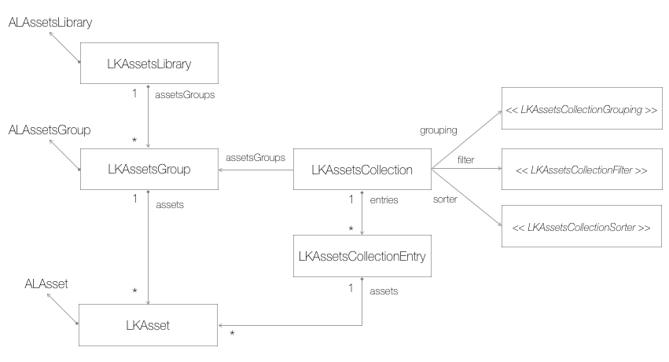
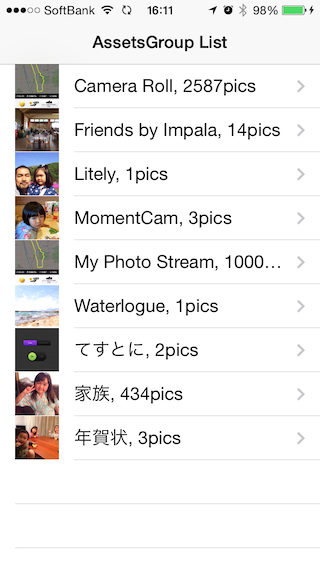
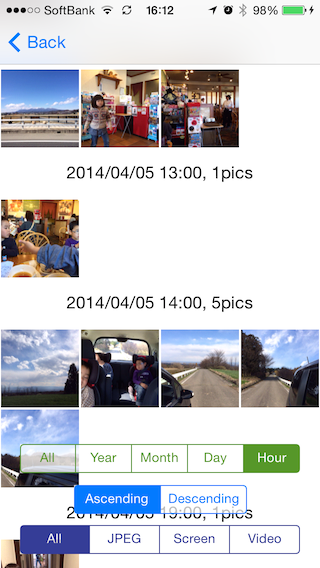

# LKAssetsLibrary

[]LKAssetsLibrary)

LKAssetsLibrary provides grouping / filter/ sorting functions for ALAssetsLibrary.

Example: Grouped by month, Filtered with JPEG and PNG, Sorted in descenting

    LKAssetsCollection
          |
          |--LKAassetsCollectionEntry (May 2014)
          |      |
          |      |--LKAsset (JPEG, 25 May 2014 10:00）
          |      |--LKAsset (JPEG, 13 May 2014 12:00）
          |      |--LKAsset (JPEG, 4 May 2014 23:00）
          |      :
          |
          |--LKAassetsCollectionEntry (Apr 2014)
          |      |
          |      |--LKAsset (JPEG, 25 Apr 2014 10:00）
          |      |--LKAsset (JPEG, 13 APr 2014 12:00）
          |      |--LKAsset (JPEG,  4 Apr 2014 23:00）
          |      :

## Usage

### Basic

LKAssetsLibrary has 3 basic classes:

    LKAssetsLibrary
    LKAassetsGroup
    LKasset
    
These are wrapper classes for ALAssetsLibrary, ALAssetsGroup, ALAsset. They has convenience methods (e.g. LKAsset.thumbnail, LKAsset.date, ...).

LKAssetsLibrary posts a notification after fetchs assets. You can handle the assets by observing the notification.

    - (void)viewDidLoad
    {
        [super viewDidLoad];
        [[NSNotificationCenter defaultCenter] addObserver:self
                                             selector:@selector(_assetsLibraryDidSetup:)
                                                 name:LKAssetsLibraryDidSetupNotification
                                               object:nil];
        self.assetsLibrary = [LKAssetsLibrary assetsLibrary];
        [self.assetsLibrary reload];
    }

Once you recieve the notification, you use LKAssetGroup or LKAsset.

    - (void)_assetsLibraryDidSetup:(NSNotification*)notification
    {
        [self.tableView reloadData];
    }

Using LKAssetsGroup for UITableViewCell.

    - (UITableViewCell *)tableView:(UITableView *)tableView cellForRowAtIndexPath:(NSIndexPath *)indexPath
    {
        UITableViewCell *cell = [tableView dequeueReusableCellWithIdentifier:@"GroupCell" forIndexPath:indexPath];
        
        LKAssetsGroup* assetsGroup = self.assetsLibrary.assetsGroups[indexPath.row];   
        cell.imageView.image = assetsGroup.posterImage;
        cell.textLabel.text = assetsGroup.description;
        return cell;
    }

Using for UICollectionViewCell.

    - (UICollectionViewCell *)collectionView:(UICollectionView *)collectionView cellForItemAtIndexPath:(NSIndexPath *)indexPath
    {
        AssetCell* cell = (AssetCell*)[collectionView dequeueReusableCellWithReuseIdentifier:@"AssetCell"
                                                                               forIndexPath:indexPath];
        LKAsset* asset = [self.assetsCollection assetForIndexPath:indexPath];
        cell.imageView.image = asset.thumbnail;
        return cell;
    }

### Collection

LKAssetsCollection has a set of assets. It has an array of LKAssetsCollectionEntry, which has assets (LKAsset array).

Class diagram is here.

The intercae of LKAssetsCollection:

    @interface LKAssetsCollection : NSObject
    
    @property (nonatomic, weak  , readonly) LKAssetsGroup* group;
    @property (nonatomic, strong, readonly) NSArray* entries;   // <lkassetscollectionentry>
    
    @property (nonatomic, strong, readonly) id <LKAssetsCollectionGrouping> grouping;
    @property (nonatomic, strong) id <LKAssetsCollectionFilter> filter;
    @property (nonatomic, strong) id <LKAssetsCollectionSorter> sorter;
    
    + (instancetype)assetsCollectionWithGroup:(LKAssetsGroup*)group grouping:(id <LKAssetsCollectionGrouping>)grouping;

    @end

    @class LKAsset;
    @interface LKAssetsCollection (NSIndexPath)
    - (LKAsset*)assetForIndexPath:(NSIndexPath*)indexPath;
    @end

The assets are extracted with 3 factors:

    <LKAssetsCollectionGrouping>   Yearly, Monthly,...
    <LKAssetsCollectionFilter>     JPEG, PNG, Screenshot,... 
    <LKAssetsCollectionSorter>     Date in ascending or descending

These are defined as protocol. The library provides generic classes here.

    LKAssetsCollectionDateGrouping
    LKAssetsCollectionGenericFilter
    LKAssetsCollectionDateSorter

You can use like below:

    LKAssetsCollectionGrouping* grouping = [LKAssetsCollectionGrouping assetsCollectionGroupingWithType:self.groupingType];
    
    self.assetsCollection = [LKAssetsCollection assetsCollectionWithGroup:self.assetsGroup
                              grouping:[LKAssetsCollectionDateGrouping groupingWithType:self.groupingType]];
    self.assetsCollection.filter = [LKAssetsCollectionGenericFilter filterWithType:LKAssetsCollectionGenericFilterTypeJPEG|LKAssetsCollectionGenericFilterTypePNG];
    self.assetsCollection.sorter = [LKAssetsCollectionDateSorter sorterAscending:NO];

LKAssetsCollectionGrouping and LKAssetsGroup can not be changed, can be changed when initializing. LKAssetsFilter and LKAssetsSorter can be changed after initializing.

## Demo

LKAssetsGroup's information are listed.

LKAssetsCollection's information are displayed. You can try various groupings, filters and sorters.

## Requirements

iOS7

## Installation

LKAssetsLibrary is available through [CocoaPods](http://cocoapods.org). To install
it, simply add the following line to your Podfile:

    pod "LKAssetsLibrary"

## Author

Hiroshi Hashiguchi, xcatsan@mac.com

## License

LKAssetsLibrary is available under the MIT license. See the LICENSE file for more info.
